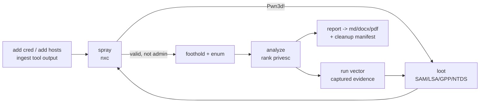

# fieldkit

The field kit for the hours between first contact and full compromise.

fieldkit is a **stateful internal-AD execution engine** for **authorized** penetration
testing. From a credential or a foothold it ingests what you know (creds, hosts,
service maps, tool output), drives proven external tools (netexec, impacket,
evil-winrm) against the scope, finds the privilege-escalation opportunity on Windows
and Linux, and reports only what it actually proved. **Standalone — clones to a base
Kali box and runs with no install** (Python 3 stdlib only; the tools it drives are
your existing kit).

> **v2 rebuild in progress.** v1 was a print-only cheatsheet: ~5,600 lines of
> generators that printed commands but held no state, parsed no tool output and could
> not be imported. That whole tree is preserved under [`archive/`](archive/) and still
> runs; the v2 engine is being built alongside it, phase by phase. `configure.sh` is
> gone — engagement config now lives in the engagement database (see below).

## Status

| Phase | What it adds | State |
|---|---|---|
| **0** | state store, engagement config, credential model, `init`/`config`/`add`/`status` | **done** |
| **1** | nxc `spray` + `(Pwn3d!)` parsing, `ingest`, loot → creds, the credential loop, `analyze` + KB detect predicates | **done** |
| **1.5** | Defender lab harness (`lab test`), `evasion.py`, technique green/red matrix, `posture` | **done** |
| **2** | transports, executor with capture + safety gate, `enum`, per-vector privesc drivers, `run` | **done** |
| 3 | report (`--check`, md/docx/pdf, cleanup manifest) + recce bridge | planned |
| 4 | Kerberos/delegation/ADCS/BloodHound depth | planned |

Until Phase 3 lands, reporting still runs through `report/gen_report.py` (v1) and the
recce contract stays green.

## Quick start

```bash
# 0) attacker box: verify tooling + pre-stage supplied binaries before an (air-gapped) engagement
sh report/preflight.sh          # checks TOOLS
sh report/avcheck.sh            # static-signature FLOOR test (ClamAV) — never a Defender verdict
#   + work through SUPPLIED-BINARIES.md (Potato exes, CVE PoCs, PEAS — the kit doesn't ship these)

bin/fieldkit config set lab_host=10.13.13.5    # a Defender-on lab VM
bin/fieldkit lab test           # prove which delivery paths evade the real Defender
bin/fieldkit posture            # the green/red matrix — everything is red until lab-proven

# 1) one engagement = one database in the working directory
bin/fieldkit init 'ACME internal'
bin/fieldkit config set lhost=10.10.14.7 lport=443 domain=corp.local
bin/fieldkit config set lhost=192.168.56.10 --subnet 10.0.5.0/24   # segment that can't route to lhost

# 2) tell it what you know — creds in whatever form you have them
bin/fieldkit add cred 'CORP/jdoe:Winter2025!'         # or DOMAIN\user, user@corp.local, user:LM:NT,
bin/fieldkit add cred --user Administrator --hash <NT> --local   #  :NT, a secretsdump line, a ccache
bin/fieldkit add cred --from-file creds.txt
bin/fieldkit add hosts scope.txt                       # IPs, CIDRs, or 'IP hostname' lines

# 3) run the credential loop: spray every cred across the scope, parse (Pwn3d!),
#    loot owned hosts, promote what it recovers, re-spray until dry
bin/fieldkit spray smb                                  # reads the lockout policy first
bin/fieldkit ingest nxc capture.txt                     # or fold in a spray you ran by hand

# 4) escalate a foothold: enumerate it, rank the vectors, fire one (captured)
bin/fieldkit enum 10.0.0.7                              # read-only, feeds analyze
bin/fieldkit analyze --proof                            # loop opportunities + privesc vectors
bin/fieldkit run 10.0.0.7 sudo:find                     # read-only vector; --allow for riskier

# the board
bin/fieldkit status --hosts --creds
```

Everything `run` does to a target goes through the executor: the command is
captured verbatim as evidence, the **safety gate** refuses a `config-change` /
`crash-risk` vector unless you pass `--allow`, and anything a vector changes is
recorded in a cleanup manifest.

`spray` reuses each account's own proven secret, so it cannot lock a domain
account; it still reads the domain password policy up front and surfaces it. The
loop stops when a round adds no new access and no new credential.

`bin/fieldkit` is a shim for `python3 -m fieldkit`; either works from a clone. The
database defaults to `./engagement.db` (override with `--db` or `$FIELDKIT_DB`).

**Every `add cred` echoes its interpretation before storing anything:**

```
$ fieldkit add cred 'CORP/jdoe:Winter2025!'
parsed as → domain=CORP  user=jdoe  secret='Winter2025!' (password)  local_auth=no
add 1 credential? [y/N]
```

A wrong-format credential is caught at input, not forty hosts into a spray. Pass
`--yes` when scripting.

## Design

- **The credential loop is the spine.** `ingest → spray → parse (Pwn3d!) → dump on
  admin hosts → recover creds → spray again`, until it goes dry. Lockout-safe by
  construction: read the domain password policy before any spray, throttle to it.
- **Orchestrate, don't reimplement.** fieldkit is the brain — state, the loop,
  credential normalization, privesc analysis, reporting. netexec/impacket own the
  protocols.
- **One canonical credential model.** Liberal ingest, strict output: renderers emit
  `subprocess` arg-lists, never shell strings, so a password containing quotes or
  backslashes reaches the tool intact.
- **Everything that runs is captured.** Verbatim stdout/stderr/exit for every executed
  command lands in state as evidence, so the report's anti-fabrication gate passes by
  construction.
- **Three-axis ranking.** Vectors are ranked by exploitability × safety
  (`read-only`→`crash-risk`) × detection risk, so the quiet, safe, precondition-met
  path floats to the top. Each vector carries a `safe_proof` that demonstrates it
  without detonating it, and every change lands in a cleanup manifest.
- **Assume-caught.** Defender is on. Evasion is a ranking axis, not a bolt-on: prefer
  native paths with no AMSI surface, treat every evasion technique as caught until
  lab-proven, detect a runtime catch and fall back instead of re-firing.
- **Config in state, never in source.** v1's `configure.sh` `sed`-edited LHOST into
  tracked files — a dirty tree plus a `git checkout` could point a payload at the
  *previous* client. Config now travels with the engagement database.

## Layout

| Path | What |
|---|---|
| `fieldkit/` | the v2 package — state/config/creds/scope, the loop (`netexec`, `ingest`, `spray`, `dump`, `kb`), execution (`transport`, `executor`, `runner`, `hostenum`, `privesc`), and evasion (`evasion`, `lab`) |
| `bin/fieldkit` | run it from a clone without installing |
| `tests/` | unit tests + the recce integration contract |
| `report/` | v1 findings → Markdown + DOCX + PDF (ported in Phase 3) |
| `exploits/` | operator-staged binaries/PoCs (air-gap); see `SUPPLIED-BINARIES.md` |
| `archive/` | the v1 print-only tree: `access/`, `winpriv/`, `linpriv/`, `novelre/` |

The engagement database holds client credentials **in the clear**. Treat it as loot:
encrypted storage, destroyed with the rest of the evidence. It is gitignored.

## Companion: recce (enumeration + reporting)

Pairs with [**recce**](https://github.com/dloucks01/recce), which does the
enumeration/reporting half of the engagement. `recce fieldkit-export` seeds fieldkit's
mass triage with the hosts it already found *and confirmed vulnerable*;
`gen_report.py findings.json --export-recce` → `recce fieldkit-import` folds your
proven findings back into recce's workbook + report. See
**[`INTEGRATION.md`](INTEGRATION.md)**.

## Scope

Internal-network engagements from a credential or foothold through lateral movement
and local privilege escalation to reporting. **Deliberately out of scope:** phishing /
AiTM session-stealing, persistence, physical/wireless, and beacon/BOF-grade evasion
(fieldkit states a path's detection risk rather than promising invisibility).
**Authorized engagements only** — every component assumes you have permission for the
target.


