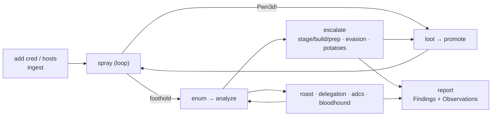

# fieldkit

The field kit for the hours between first contact and full compromise.

fieldkit is a **stateful internal-AD execution engine** for **authorized** penetration
testing. From a credential or a foothold it ingests what you know (creds, hosts, tool
output), drives your proven tools (netexec, impacket, evil-winrm, certipy) against the
scope, runs the credential loop, escalates to SYSTEM/root, and reports only what it
actually proved. **Standalone — clones to a base Kali box and runs with no install**
(Python 3 stdlib only; the tools it drives are your existing kit).

**New here?** → the one-page runbook is **[`QUICKSTART.md`](QUICKSTART.md)**, the visual
map is **[`WORKFLOW.md`](WORKFLOW.md)**, the deep reference is
**[`TECHNICAL-GUIDE.md`](TECHNICAL-GUIDE.md)**.

## What it does

```
add cred/hosts → spray (loop: loot → promote → re-spray) → enum → analyze
      → escalate (auto: stage/build/prep, evasion re-delivery, Potato variants)
      → roast / delegation / adcs / bloodhound → report (Findings + Observations)
```

- **The credential loop is the spine.** `spray → parse (Pwn3d!) → loot SAM/LSA/NTDS →
  promote recovered secrets → spray again`, until dry. Lockout-safe by construction: it
  reads the domain password policy first and replays only each account's own proven secret.
- **The orchestrator escalates for you.** `escalate` walks the ranked vectors and follows a
  fallback axis — advance, retry, stop on proof, halt on the unknown; on a miss it
  **auto-stages** a tool from the arsenal, **auto-builds** a payload (`poc`), or
  **download-stages** it over the exec transport when there's no `--put-file` path; on an AV
  catch it **climbs the delivery ladder**; for SeImpersonate it tries the **Potato variants**
  (GodPotato / PrintSpoofer / JuicyPotatoNG / SweetPotato / SharpEfsPotato). Routes it can't
  one-shot (overwrite a running binary, plant a DLL) are handed to `prep`.
- **MSSQL is a real path.** Sysadmin → xp_cmdshell → SYSTEM; and a non-sysadmin login →
  sysadmin via `EXECUTE AS` impersonation (`fieldkit mssql escalate`).
- **Everything that runs is captured**, so the report's anti-fabrication `--check` passes by
  construction — a finding can't render without the command + output that proved it.
- **Assume-caught.** Evasion is a ranking axis: every technique is red until a Defender lab
  proves it clean; a live catch marks it red and the loop falls back.

## Quick start

```bash
# one engagement = one database in the working directory
bin/fieldkit init 'ACME internal'
bin/fieldkit config set lhost=10.10.14.7 lport=443 domain=corp.local

# tell it what you know (creds in whatever form you have them)
bin/fieldkit add cred 'CORP/jdoe:Winter2025!'      # DOMAIN\user, user@corp.local, user:LM:NT, …
bin/fieldkit add hosts scope.txt                   # a single IP, a CIDR, or a file of them

# run the loop, then escalate a foothold
bin/fieldkit spray smb                             # reads the lockout policy first
bin/fieldkit enum 10.0.0.7
bin/fieldkit analyze
bin/fieldkit escalate 10.0.0.7 --allow config-change

# go wide in AD (any order)
bin/fieldkit roast --dc 10.0.0.10
bin/fieldkit delegation --dc 10.0.0.10
bin/fieldkit adcs find --dc 10.0.0.10
bin/fieldkit bloodhound import ./bh/

# write it up (Findings + Observations, straight from captured evidence)
bin/fieldkit report --check                        # anti-fabrication gate
bin/fieldkit report -o report                      # report.md (+ .docx/.pdf via pandoc)
bin/fieldkit report --cleanup -o report            # internal artifact-removal manifest
bin/fieldkit export-recce recce.json               # fold proven findings into recce

bin/fieldkit status                                # the board, any time
```

Riskier vectors need `--allow config-change` (or `crash-risk`); read-only runs freely.
`bin/fieldkit` is a shim for `python3 -m fieldkit`; the DB defaults to `./engagement.db`
(`--db` / `$FIELDKIT_DB`). Every `add cred` echoes its interpretation before storing —
a wrong-format credential is caught at input, not forty hosts into a spray (`--yes` to skip).

## Design

- **Orchestrate, don't reimplement.** fieldkit is the brain — state, the loop, credential
  normalization, escalation, reporting. netexec/impacket/certipy own the protocols; msfvenom/
  wixl/gcc own the payload bytes.
- **One store, everything is a projection.** All state is one SQLite DB; `analyze` ranks what
  it proves, `report` renders the captured evidence. Stop and resume anywhere.
- **One canonical credential model.** Liberal ingest, strict output: renderers emit argv
  lists, never shell strings, so quotes/backslashes reach the tool intact.
- **Three-axis ranking** (exploitability × safety × detection) orders every move, so the
  quiet, safe, precondition-met path floats up.
- **Findings vs Observations.** The report proves what it exploited (Findings, with the full
  captured walkthrough) and clearly labels what it only identified (Observations).

## Layout

| Path | What |
|---|---|
| `fieldkit/` | the engine — state/config/creds/scope, the loop (`netexec`, `ingest`, `spray`, `dump`, `kb`), execution (`transport`, `executor`, `runner`, `hostenum`, `privesc`, `poc`, `classify`, `escalate`, `staging`, `mssql`), AD depth (`kerberos`, `delegation`, `adcs`, `bloodhound`), evasion (`evasion`, `lab`), reporting (`report`, `reportkb`, `bridge`), and the thin `cli` |
| `bin/fieldkit` | run it from a clone without installing |
| `tests/` | the test suite (~490, ~2s, no network/tools needed) |
| `exploits/` | operator-staged binaries/PoCs (air-gap); see `SUPPLIED-BINARIES.md` |
| `QUICKSTART.md` · `WORKFLOW.md` · `TECHNICAL-GUIDE.md` | operator docs; `CLAUDE.md` = architecture notes |
| `package.sh` | bundle source + staged exploits into one archive for an air-gapped box |

The engagement database holds client credentials **in the clear** — treat it as loot
(encrypted storage, destroyed with the rest of the evidence). It is gitignored.

## Companion: recce

Pairs with [**recce**](https://github.com/dloucks01/recce), the enumeration/reporting half.
`recce fieldkit-export` seeds triage with confirmed-vulnerable hosts; `fieldkit export-recce`
→ `recce fieldkit-import` folds your proven findings back into recce's workbook + report. See
**[`INTEGRATION.md`](INTEGRATION.md)**.

## Scope

Internal-network engagements from a credential or foothold through lateral movement and local
privilege escalation to reporting. **Out of scope by design:** phishing / AiTM, persistence,
physical/wireless, and beacon/BOF-grade evasion (fieldkit states a path's detection risk
rather than promising invisibility). **Authorized engagements only** — every component assumes
you have permission for the target.


